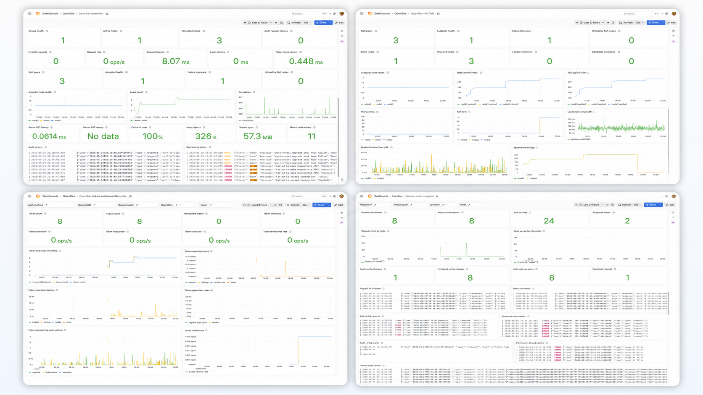
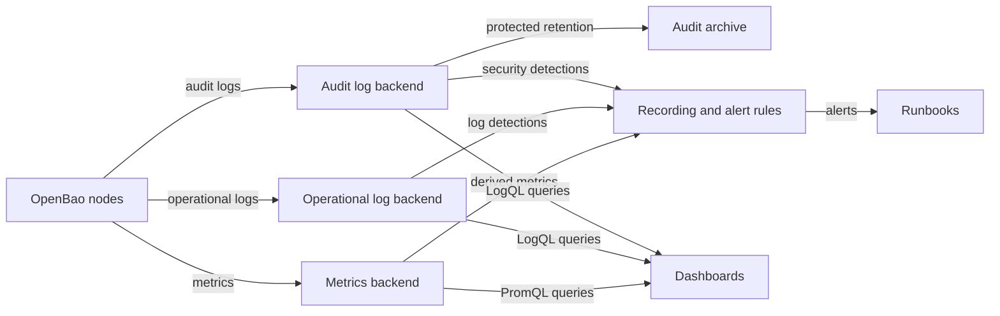

# OpenBao observability reference architecture

[](https://github.com/dc-tec/openbao-observability/actions/workflows/ci.yml)

Use this repository as an OpenBao observability reference architecture for
metrics, operational logs, audit logs, dashboards, alerts, runbooks, and local
validation fixtures. It defines portable observability intent first, then
provides a tested Prometheus, Loki, Grafana, and Grafana Alloy profile that you
can adapt to your monitoring and logging platforms.

The project starts from verified OpenBao behavior instead of copied Vault
dashboard assumptions. Contracts under `contracts/` describe the source signal
model; generated artifacts under `generated/` show one concrete implementation
profile.



*Figure 1: Generated Grafana dashboards from the local OpenBao observability
profile.*

## What this repository provides

- Signal contracts for OpenBao metrics, log streams, alerts, and dashboards.
- Generated Prometheus recording rules and alert rules.
- Generated Loki alert reference artifacts.
- Generated Grafana dashboard JSON files.
- Grafana Alloy examples for operational logs, audit logs, and collection
  pipelines.
- Runnable Docker Compose and Kubernetes examples.
- Fixture capture and validation for verified OpenBao behavior.
- Documentation for operating OpenBao observability safely.

## Architecture at a glance

Every implementation profile maps the same OpenBao signals to a local
monitoring stack. The included profile uses Prometheus for metrics, Loki for
logs and audit logs, Grafana Alloy for collection, and Grafana for dashboards.



## Start here

| Goal | Start with |
| ---- | ---------- |
| Understand the architecture | [Reference architecture overview](docs/reference-architecture/overview.md) |
| Learn the signal model | [OpenBao observability model](docs/concepts/openbao-observability-model.md) |
| Run the local stack | [Run the Docker Compose stack](docs/docker-compose.md) |
| Adopt the design in your platform | [Adopt the reference architecture](docs/reference-architecture/adoption.md) |
| Use the included implementation profile | [Prometheus, Loki, Grafana, and Alloy profile][prometheus-loki-grafana-alloy] |
| Configure metrics scraping | [Secure metrics scrape](docs/metrics/secure-metrics-scrape.md) and [all-node metrics scrape](docs/metrics/all-node-metrics-scrape.md) |
| Read the dashboards | [Dashboard documentation](docs/README.md#dashboards) |
| Respond to alerts | [Alert runbooks](docs/README.md#respond) |
| Use this with the OpenBao Operator | [OpenBao Operator companion profile](docs/implementation-profiles/openbao-operator.md) |

Use the [documentation index](docs/README.md) when you want the complete
documentation set.

## Run locally

Run the local Docker Compose profile when you want to inspect the generated
dashboards and alerts with a working OpenBao HA fixture.

```shell
make compose-up
```

Open Grafana at `http://127.0.0.1:13000` and sign in with `admin` / `admin`.
See [Run the Docker Compose stack](docs/docker-compose.md) for endpoints,
verification steps, and troubleshooting.

Stop the local stack when you finish.

```shell
make compose-down
```

Regenerate fixtures and artifacts when you change contracts, generators, or
fixture scenarios.

```shell
make fixtures-openbao
make generate
```

> [!WARNING]
> The Docker Compose stack is for local evaluation and contract validation. It
> uses HTTP, deterministic local credentials, and local-only OpenBao setup. You
> must not use it for production, shared environments, or sensitive data.

## Use this with your platform

Adopt the architecture by preserving the OpenBao signal semantics and mapping
the storage, query, alerting, and dashboard layers to your environment.

- Port metric contracts and alert intent to your metrics backend.
- Port log and audit log detections to your log analytics backend.
- Keep label and attribute choices low-cardinality and safe for shared systems.
- Treat audit logs as protected security records with explicit retention and
  access controls.
- Treat dashboard panels as operator questions, then implement those questions
  in your visualization layer.
- Keep runbooks close to the alerts that page your team.

## Tested profile

The current implementation profile includes:

- OpenBao `2.5.4` fixture capture.
- Prometheus-compatible OpenBao metrics.
- Prometheus recording rules and alert rules.
- Loki log and audit log alert reference artifacts.
- Grafana dashboards generated from dashboard contracts.
- Grafana Alloy collection examples.
- A local Docker Compose stack with OpenBao, PostgreSQL, Prometheus, Loki,
  Grafana Alloy, and Grafana.
- Kubernetes examples for secure active-node and private all-node metrics
  scrape profiles.

## Generated artifacts

The repository publishes generated artifacts from source contracts under
`contracts/`. Use these artifacts directly, or port their intent into your own
delivery pipeline:

- `generated/prometheus/`: native Prometheus rule files.
- `generated/prometheusrules/`: Prometheus Operator `PrometheusRule` manifests.
- `generated/loki/`: Loki alert reference artifacts.
- `generated/grafana/`: Grafana dashboard JSON files.
- `generated/docs/`: generated reference documents.

Generated artifacts are outputs. Edit contracts first, then regenerate.

```shell
make generate
```

## Validate and contribute

Run the full verification before you publish or propose changes.

```shell
make verify
```

Build the Hugo documentation site locally when you change `docs/`, `website/`,
or `hugo.toml`.

```shell
make docs-build
```

Validate dashboard PromQL and LogQL against a running Compose stack when
dashboard queries change.

```shell
make validate-dashboard-queries
```

Use [Contributing](CONTRIBUTING.md) before you change docs, contracts,
examples, generated artifacts, or validation code.

## Repository layout

| Path | Purpose |
| ---- | ------- |
| `.github/` | CI and release automation. |
| `cmd/` | Go command-line entry points for project tooling. |
| `contracts/` | Source contracts for metrics, log streams, alerts, and dashboards. |
| `dashboards/` | Dashboard-specific source material. |
| `docs/` | User-facing documentation. |
| `examples/` | Runnable local and deployment examples, including Docker Compose. |
| `fixtures/` | Captured metrics and log fixtures used by tests. |
| `generated/` | Generated artifacts produced from contracts. |
| `hugo.toml` | Hugo site configuration for the documentation site. |
| `internal/` | Go packages that implement fixture capture and validation. |
| `website/` | Hugo layouts, assets, and site-only content. |

## License

This project is licensed under the [Apache License, Version 2.0](LICENSE).

Copyright 2026 OpenBao Observability contributors.

[prometheus-loki-grafana-alloy]: docs/implementation-profiles/prometheus-loki-grafana-alloy.md
